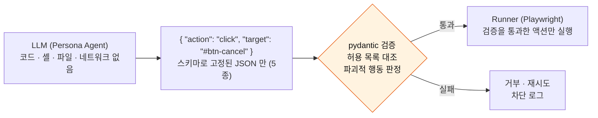

# Agent 계정 · 격리 · 행동 제한 (v1.1, 2026-09-19)

09/14 제안서 발표에서 교수님이 던진 두 질문에서 출발한 설계 요구사항. **S1 요구분석 산출물에 포함한다.** PM 승인 09/19 (v1.1).

> **Q1.** Agent 가 대상 서비스에 진입할 때 계정 1개로 들어가는가? 그에 대한 보안 처리는?
> **Q2.** 최근 OpenAI Agent 가 샌드박스를 벗어나 HF 를 건드린 사례처럼, Agent 를 어떻게 관리할 것인가?

## 0. 발표 답변 복기 — 무엇을 놓쳤나

| | 발표 답변 | 평가 |
| --- | --- | --- |
| A1 | 계정은 entry 단이라 핵심이 아니다. 우선 계정 1개. auth · RBAC 고려 중 | **질문의 핵심을 비껴갔다.** 교수님이 물은 건 *우리 서비스의* 인증(RBAC)이 아니라 *대상 서비스에 들어가는 Agent 의 계정*이다. 계정 1개로 50개를 돌리면 **①상태 오염 ②동시 세션 차단 ③자격증명 노출** 세 문제가 바로 생긴다 (§1) |
| A2 | Watcher 가 관리한다. 하네스 · 샌드박스를 잘 구축하겠다 | **방향은 맞지만 내용이 없다.** "잘 구축" 이 무엇인지 — 행동 스키마 · 도메인 제한 · 파괴적 행동 차단 · 한도 — 를 말할 수 있어야 한다 (§2) |

두 답 모두 "고려 중" 으로 끝났다. 설계서(10/02)에는 아래가 **확정된 형태로** 들어가야 한다.

## 1. Q1 — 대상 서비스 계정과 자격증명

### 1.1 계정 1개로 50개를 돌리면 생기는 일

| 문제 | 왜 생기나 | 예 |
| --- | --- | --- |
| **상태 오염** | Task 가 계정 상태를 바꾼다. 첫 Agent 가 성공하면 나머지 49개는 **다른 화면**을 본다 | "와우 멤버십 해지" — 1번이 해지하면 2번부터는 해지 메뉴 자체가 없다. 실패로 집계됨 → **진단이 통째로 틀린다** |
| **동시 세션 차단** | 같은 계정 50개 세션은 대상 서비스가 봇/이상 로그인으로 막는다 | 강제 로그아웃 · CAPTCHA · 계정 잠금 |
| **자격증명 노출** | 로그인 정보가 프롬프트 · 로그 · 스크린샷에 남는다 | LLM 에 비밀번호가 들어가는 순간 통제 불가 |
| **약관 · 법적** | 자동화 접근이 대상 서비스 약관 위반일 수 있다 | 실서비스에 봇을 붙이는 것 자체 |

### 1.2 결정 — 대상 · 계정 · 자격증명 정책

| 항목 | 정책 |
| --- | --- |
| **기본 대상** | ①**로그인 없는 공개 플로우** ②**우리가 소유한 테스트 사이트**(결함을 심어둔 사이트 — `assessment` 컷 목록의 "정답 있는 테스트 사이트" 와 동일 산출물) |
| **로그인이 필요한 Task** | **테스트 계정 풀** — Persona 당 계정 1개 또는 실행 당 계정 1개. 풀은 운영자 화면에서 등록 · 할당 · 회수 |
| **상태를 바꾸는 Task** (해지 · 구매 · 삭제) | **실서비스 금지.** 테스트 사이트 또는 스테이징에서만. 실서비스 데모는 **최종 확인 직전에서 멈추고 성공으로 판정** (§2.3 파괴적 행동 차단과 같은 장치) |
| **세션 격리** | 브라우저 1개에 **context N개** — context 마다 쿠키 · 스토리지 분리. 계정 풀과 1:1 |
| **자격증명 보관** | 서버(Spring) 에 **암호화 저장**, 실행 시 Playwright 로그인 스텝에만 주입. **LLM 프롬프트에 절대 넣지 않는다** — 로그인은 LLM 이 아니라 스크립트가 한다 |
| **로그 마스킹** | 행동 로그 · 스크린샷 · DOM 스냅샷에서 입력 필드 값 마스킹 (`type` 액션의 value 는 `***`). **SoM 스크린샷(T18)은 입력 필드 영역 블러** — 모델에 보내기 전에 |
| **우리 서비스 인증** | 운영자 / 리서처 RBAC (D15). 이건 Q1 의 답이 아니라 별개 항목 |

### 1.3 제안서 예시(쿠팡)에 대한 정직한 위치

"쿠팡 와우 멤버십 해지" 는 **설명용 시나리오**다. 실제 실험은 ①공개 플로우(로그인 없는 탐색 · 검색 · 정보 찾기) ②학교 홈페이지 스냅샷 사본에 결함을 심은 것 ③해지 플로우를 한 번 기록해 만든 **로컬 mock** 으로 돌린다 (D20). 실서비스 계정에는 붙이지 않는다.
교수님이 다시 물으면 이렇게 답한다: *"실서비스 계정에 봇을 붙이지 않습니다. 결함을 알고 있는 자체 테스트 사이트와 로그인 없는 공개 플로우가 실험 대상이고, 로그인이 필요하면 테스트 계정 풀을 씁니다."*

## 2. Q2 — Agent 격리와 행동 제한

### 2.1 원칙 — Agent 는 "정책", 실행기는 "능력이 제한된 손"

가장 강한 격리는 샌드박스가 아니라 **LLM 에게 실행 능력을 주지 않는 것**이다.

<!-- diagram: safety-action-path -->

> 렌더: `docs/assets/diagrams/safety-action-path.svg` · `.png` (`scripts/render-mermaid.py`)

LLM 은 코드를 실행하지 않고, 셸도 파일도 네트워크도 없다. **모델에 "실행되는 도구" 를 주지 않는다** — 제공사가 서버에서 실행하는 도구(web_search · computer use · code interpreter)는 어느 제공자에서도 요청하지 않는다. 행동 JSON 을 받는 통로는 기본이 `response_format`(구조화 출력)이고, 제공자에 따라 **우리 코드가 받기만 하는 function tool 하나**로 같은 JSON 을 받을 수 있다 (§2.4) — 어느 쪽이든 실행은 Runner 가드 뒤에서만 일어난다.

### 2.2 통제 항목

| # | 통제 | 구현 | 담당 |
| --- | --- | --- | --- |
| 1 | **행동 스키마 고정** | `click · type · scroll · back · done` 5종만. 그 외 JSON 은 거부 · 재시도 | AI |
| 2 | **도메인 허용 목록** | 실행마다 대상 도메인을 지정. 다른 도메인으로의 이동은 Runner 가 차단하고 Watcher 에 보고 | BE · AI |
| 3 | **파괴적 행동 차단** | 결제 · 삭제 · 해지 · 전송 계열 요소(버튼 텍스트 · form action · URL 패턴)를 **최종 클릭 직전에 가로챈다.** 정책: 테스트 사이트 = 통과 / 실서비스 = 차단 + 성공 판정 | AI · BE |
| 4 | **프롬프트 인젝션 방어** | 페이지 텍스트는 **신뢰하지 않는 입력**. 시스템 프롬프트 고정, DOM 은 데이터로만, 숨김 텍스트(display:none · 0px · 화면 밖) 제거. "지시를 따르라" 류 문구를 만나도 행동 스키마 밖으로 못 나간다 | AI |
| 5 | **한도** | step 상한(20) · 시간 상한 · 실행당 토큰/비용 상한 · 동시 실행 상한 — 운영자 화면 정책(D15). 초과 시 Watcher 가 종료 | BE |
| 6 | **브라우저 격리** | Playwright 는 컨테이너에서, 파일시스템 쓰기 없음, 네트워크는 대상 도메인 + LLM 엔드포인트만(egress 허용 목록), context 는 실행 후 폐기 | PM(인프라) |
| 7 | **Kill switch** | 운영자가 실행 단위 · 전체 단위로 즉시 중단 | BE · FE |
| 8 | **감사 로그** | 모든 액션 = (관찰 · 추론 · 액션 · 결과 · 타임스탬프). 차단된 액션도 남긴다. 이미 Friction Detector 의 입력이라 추가 비용 없음 | AI · BE |

### 2.3 Watcher 의 역할 (tech-stack §9 와 같은 결론)

Watcher 는 **제어면**이다 — 시작 · 상한 · 멈춤 감지 · 차단 보고 · 종료. Agent 와 대화하지 않는다.
"Agent 관리" 의 실체는 위 표의 1~8 이고, Watcher 는 5 · 7 을 집행하고 2 · 3 의 보고를 받는 자리다.

### 2.4 LLM 제공자 이식성 — 프록시 제약 시 pivot 대비 (09/19)

회사 프록시(기본)가 개발 중 막히면 — 코드성 프롬프트 차단이 계속되거나, 필요한 모델 배포를 못 받거나, vision 모델이 없으면 — **OpenRouter 또는 OpenAI 네이티브로 옮긴다.** 옮겨도 §2.1 원칙이 그대로 서도록 클라이언트를 이렇게 짠다.

| 항목 | 설계 |
| --- | --- |
| 인터페이스 | `LLMClient.complete_action(messages, schema=Action) -> Action \| None` 하나. Persona 루프 · Detector · Diagnosis 는 이 함수만 부른다 — 제공자 · 모델명 · 호출 방식을 모른다 |
| 출력 채널 2모드 | **(a) `response_format`** — json_schema / pydantic parse. 기본값. **(b) `function_tool`** — 도구를 **`emit_action(Action)` 하나만** 정의하고 `tool_choice` 로 강제, `tool_calls[0].arguments` 를 같은 pydantic 으로 검증. (a) 가 불안정한 모델 · 제공자에서 쓴다. **두 모드의 출력은 같은 `Action` 이고 같은 가드를 지난다** |
| 왜 (b) 가 안전한가 | function tool 은 **"모델이 호출을 요청하고 우리 코드가 실행하는"** 구조다. 우리 코드는 실행하지 않고 JSON 을 꺼내기만 한다. 모델에 실행 능력이 생기는 게 아니다 |
| 계속 금지 | provider-executed tool 전부. 클라이언트가 `tools` 목록을 `emit_action` 하나로 고정하고, 그 외 도구 정의는 코드 리뷰에서 막는다 (`AGENTS.md`) |
| 설정 | `LLM_PROVIDER=proxy \| openrouter \| openai` + 역할별 base URL · 모델명 · 키 (architecture §10). **코드 변경 없이 env 로 전환** |
| 제공자별 차이 (확인해 둘 것) | 프록시: 배포 단위 모델 핀 · 코드성 프롬프트 차단 가능(T19). OpenRouter: 모델 폭 최대, `provider/model` 표기, 응답 필드가 제공자마다 조금 다름, `response_format` 은 모델별 지원 편차 → (b) 모드가 필요한 자리. OpenAI 네이티브: 둘 다 안정, 비용은 우리 부담 |
| 검증 | 09/25 드라이런의 3단계(실제 관측 프롬프트)를 **프록시 + OpenRouter 두 번** 돌려 (a)/(b) 모드 모두 통과시킨다 — 그러면 pivot 이 "결정" 이지 "작업" 이 아니게 된다 |
| 공수 | 클라이언트 추상화 + (b) 모드 + 2제공자 테스트 = **4~6h** (S2 초) |

## 3. 일정 · 볼륨

| 항목 | 언제 | 추가 공수 |
| --- | --- | --- |
| §1.2 정책 확정 · §2.2 표 → 설계서 반영 | S1 (~09/27) | 문서 4h |
| 행동 스키마 · 도메인 허용 · 한도 (1 · 2 · 5) | S2~S3, Persona Agent 와 함께 | 거의 0 — 원래 설계에 포함 |
| LLM 클라이언트 추상화 · function_tool 모드 · 2제공자 테스트 (§2.4) | S2 초 | 4~6h |
| 파괴적 행동 차단 · 인젝션 방어 (3 · 4) | S3 | 12~16h |
| 계정 풀 · 자격증명 암호화 · 마스킹 (§1.2) | S3~S4 | 12h |
| 컨테이너 격리 · egress 허용 목록 · kill switch (6 · 7) | S2 인프라 · S4 | 8h |
| 테스트 사이트(결함 심은) | S2 | 20h — **assessment 에서 이미 요청한 항목**, 여기서 근거가 하나 더 붙는다 |

합계 약 **60h**. `assessment-2026-09-12.md` 의 수요 470h 에 없던 항목이라 **컷 목록 발동 압력이 커진다.** 다만 테스트 사이트 20h 는 이미 계산에 있었고, 3 · 4 · 6 은 "있으면 좋은" 이 아니라 **없으면 교수님 질문에 답이 안 되는** 항목이다.

## 4. 결정 로그 반영

- D17 — 실험 대상 정책 (공개 플로우 · 자체 테스트 사이트 · 실서비스 상태 변경 금지)
- D18 — Agent 격리 원칙 (LLM 은 실행 능력 없음 · 행동 스키마 · 도메인 허용 · 파괴적 행동 차단 · 한도 · 감사 로그)
- T20 — LLM 제공자 이식성: 클라이언트 추상화 · 출력 채널 2모드(response_format / emit_action function tool) · provider-executed tool 금지 유지 (§2.4)
- D20 — 실험 대상 (스냅샷 주입 · 쿠팡 해지 mock)
- 발표 Q&A 기록 → `meetings/2026-09-14-presentation.md`
