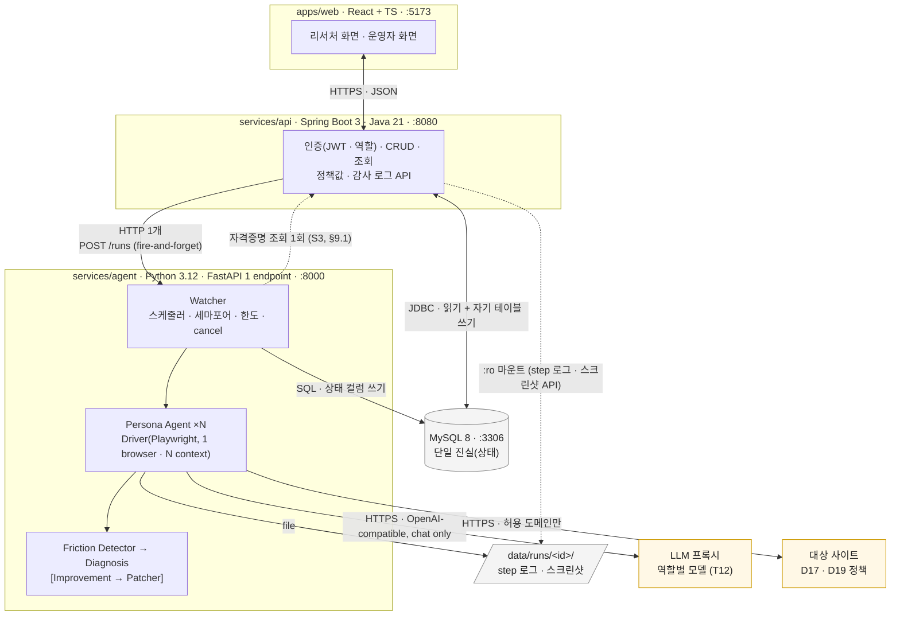
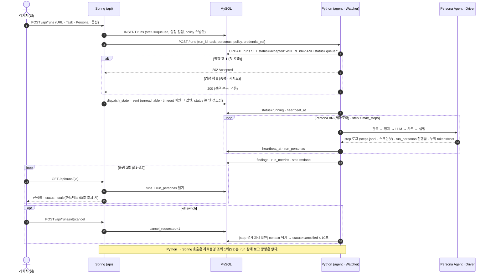
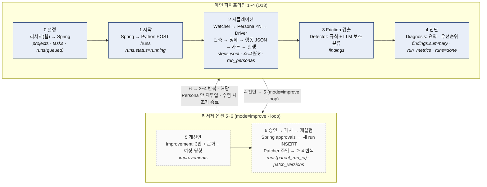
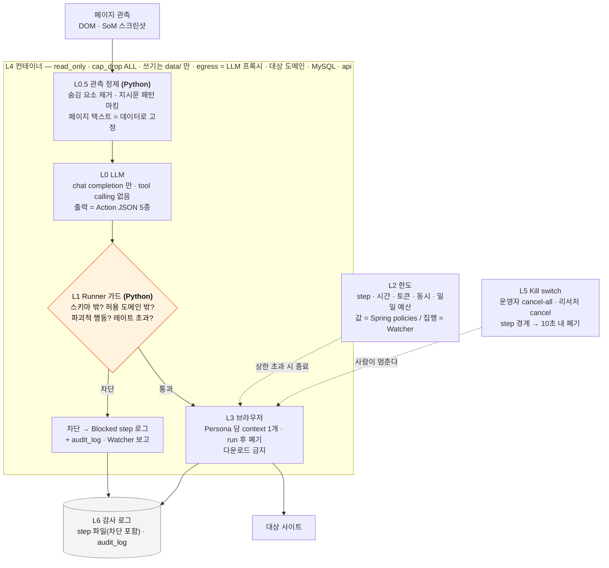

# 아키텍처 — 전체 구조 + Agent 권한 구조 (v0.4, 2026-09-20)

**상태: PM 승인 (09/19) · 리드 확인 09/20 AI·BE 대면 완료 — BE 미결 5건 확정, 큰 틀 고정. 남은 §12 는 리드가 닫는다.** 리드가 이 문서를 기준으로 S1 티켓을 잡는다 — BE 76·77·69, AI 72, FE 73~75.
표시가 **[초안 — 리드가 채운다]** 인 절은 PM 이 뼈대만 잡은 것이고, 확정은 해당 리드가 한다. 뒤집으면 `decisions.md` 에 줄을 추가한다.

이 문서가 답하는 질문 세 개:

1. **무엇이 어디에 있나** — 컴포넌트 · 언어 · 담당 · 저장소 디렉터리 (§1 · §2 · §10)
2. **Spring 과 Python 은 어떻게 붙나** — 계약 · 상태 · 실패 모드 · 테이블 소유 (§3 · §4)
3. **Agent 는 어떻게 가둬지나** — 권한 층 · 검증 위치 · 자격증명 경계 (§9)

안 다루는 것: 화면 설계(FE, `GACA-74`) · Friction threshold(`GACA-68`) · Persona 속성 형식(`GACA-66`) · 배포 서버 상세(S2 `GACA-43`) · 비용.

근거 문서: `product-direction.md`(범위) · `tech-stack.md` §3~§4·§9·§10(스택 · 경계 · 오케스트레이션 · 루프) · `agent-safety.md`(D17 · D18) · `decisions.md`.

## 1. 한 장 그림

<!-- diagram: arch-overview -->


> 렌더: `docs/assets/diagrams/arch-overview.svg` · `.png` (`scripts/render-mermaid.py`)

읽는 법: **웹은 Spring 만 본다. Spring 은 Python 에게 "시작해" 한 번만 말한다. 그 뒤 상태는 전부 MySQL 에 있고 Spring 은 읽기만 한다.**
Python → Spring 방향은 **자격증명 조회 1회(S3, §9.1)뿐**이고 run 상태를 보고하는 방향은 없다.
Python 이 나가는 곳은 LLM 프록시 · 허용된 대상 도메인 · MySQL · Spring(api) 네 곳뿐이다 (§9 L4).

## 2. 컴포넌트 경계 · 소유

원칙 (tech-stack §4 채택안): **Spring = CRUD · 인증 · 조회 · 정책값 / Python = 실행 전부.** 오케스트레이션(병렬 · 재실험 트리거)은 Python 이다 — `asyncio` 세마포어, Watcher 는 제어면이지 대화 상대가 아니다 (tech-stack §9).

| 컴포넌트 | 책임 | 언어 · 위치 | 담당 | S1 티켓 |
| --- | --- | --- | --- | --- |
| **Web** | 리서처 화면(실험 설정 · 모니터 · 진단 · 승인 · Before/After) · 운영자 화면(계정 · 정책 · 사용량 · 감사) | TS · `apps/web` | FE | 73 · 74 · 75 |
| **API** | JWT 인증 · 역할(운영자/리서처, D15) · 프로젝트/Task/Persona CRUD · run 조회 · 정책 테이블 · 감사 로그 API · 자격증명 암호화 저장 · Python 에 `POST /runs` 1회 | Java · `services/api` | BE | 76 · 77 |
| **Watcher** | run 큐(`runs.status='queued'` 스캔) · 동시 상한(프로세스 전역 세마포어) · step/시간/토큰 상한 집행 · 멈춤/루프 감지 · cancel · 진행률 · `heartbeat_at` 을 DB 에 씀 | Python · `services/agent/uxight_agent/watcher` | AI · BE | 72 · 70 |
| **Persona Agent** | Persona 조건화 프롬프트 · 관측 → 행동 JSON(5종) · 히스토리 요약 · reasoning 기록 | Python · `…/persona` | AI | 66 · 67 |
| **Driver** | `observe()` (SoM 스크린샷 + 요소 목록 / DOM-only) · **관측 정제**(L0.5 — 숨김 텍스트 · 지시문 패턴 제거) · `act()` · 로그인 스텝(스크립트) · 블러 | Python · `…/driver` | AI · PM | 72 · 78 |
| **Runner 가드** | 행동 스키마 검증 · 도메인 허용 · 파괴적 행동 차단 · 대상 도메인 레이트 제어 — Driver 앞단 | Python · `…/guard` | AI | 72 |
| **Friction Detector** | 행동 로그(규칙) + LLM 보조 → Taxonomy 4종 우선(D11') · 심각도 | Python · `…/detect` | AI | 68 |
| **Diagnosis / Improvement** | 진단 요약 · 개선안 3안(구조화 출력) — 5·6 단계는 선택(D13) | Python · `…/diagnose` `…/improve` | AI | S2 |
| **DOM Patcher** | 패치 4종(D7) 주입 → 재실험 — 가장 위험한 조각, 둘이 본다 | Python · `…/patch` | AI · BE | S3 |
| **MySQL** | 상태의 단일 진실. 스키마 소유는 Spring(§3.4) | `docker compose` | BE | 77 |
| **run 로그 파일** | step 별 JSON + 스크린샷, run 당 디렉터리. **agent 는 쓰기, api 는 읽기 전용 마운트**(§8 · §10) | `services/agent/data/runs/<run_id>/` | AI | 77 |

## 3. Spring ↔ Python 계약

### 3.1 엔드포인트 하나

| | |
| --- | --- |
| 호출 | Spring → Python `POST /runs` (내부망, compose 네트워크) |
| 요청 | `{ "run_id", "project_id", "target_url", "task": {"goal", "success_criteria"}, "personas": [{"persona_id", "profile"}], "policy": {"max_steps", "max_seconds", "max_tokens", "run_concurrency", "rate_limit_per_domain", "allowed_domains": [], "mode": "diagnose\|improve\|loop", "loop_max"} , "credential_ref": null }` |
| 응답 | `202 Accepted` `{ "run_id", "accepted_at" }`. 중복이면 `200` 같은 본문(멱등) |
| **수락 판정** | Python 이 `UPDATE runs SET status='accepted', accepted_at=NOW() WHERE id=? AND status='queued'` 를 돌려 **영향 행 수로 판정한다 — 1 이면 수락(202), 0 이면 중복이거나 이미 진행 중(200)**. "status 가 queued 이상이면 무시" 같은 판정은 첫 호출까지 삼키므로 쓰지 않는다 |
| 이후 | Python 이 `runs.status` 를 `accepted → running → done\|failed\|cancelled` 로 갱신. Spring 은 **호출하지 않고 읽는다** |
| 인증 | 내부 공유 토큰 헤더 `X-Internal-Token` (env). 외부 노출 없음 — compose 네트워크 안에서만 |

한 run 의 왕복을 시퀀스로 보면 (3.1 수락 판정 · 3.2 폴링 · 3.3 kill switch 포함):

<!-- diagram: arch-run-sequence -->


> 렌더: `docs/assets/diagrams/arch-run-sequence.svg` · `.png` (`scripts/render-mermaid.py`)

`policy` 는 Spring 의 정책 테이블(운영자 화면 값, D15)을 **run 시작 시점에 스냅샷**해서 넘긴다. run 도중 정책이 바뀌어도 그 run 은 시작값을 따른다 (재현성).
**스냅샷하지 않는 값 둘:**

- **동시 실행 상한** — 세마포어는 Watcher 프로세스에 **전역으로 하나**이고 값은 운영자 정책의 현재값이다. run 마다 스냅샷한 값으로 세마포어를 만들면 run 이 늘어날수록 실제 동시 브라우저 수가 곱해져 RAM 상한이 무너진다. 스냅샷된 `run_concurrency` 는 **그 run 안에서 동시에 도는 Persona 수 상한**으로만 쓴다.
- **일일 토큰 예산** — 여러 run 이 같이 쓰는 값이라 스냅샷이 성립하지 않는다. 매 LLM 호출 직전에 **DB 의 당일 누적값**을 읽어 집행한다 (§7 `run_metrics` · `runs` 합계).

`personas[].profile` 도 run 시작 시점 스냅샷이며 Python 이 `runs.persona_snapshot(json)` 에 그대로 저장한다 — 나중에 `personas` 가 바뀌어도 과거 run 을 재현할 수 있어야 한다.
**[초안 — 한재완·박소영이 필드를 확정한다 (GACA-77)]**

### 3.2 비동기 모델 — 폴링으로 시작

| 단계 | 방식 | 근거 |
| --- | --- | --- |
| **S1~S2** | 웹 → Spring `GET /api/runs/{id}` **폴링 3초**(screens-sketch R3 와 같은 값). Spring 은 `runs` + `run_personas` 를 읽어 진행률을 계산해 돌려준다 | 구현 최소. 리서처 1~2명이라 부하 없음 |
| S3 검토 | Spring SSE 또는 Python → Spring 콜백 | 폴링이 UX 상 거슬릴 때만. 콜백은 "Spring 이 떠 있어야 Python 이 돈다" 결합을 만든다 |

### 3.3 실패 모드

**전제 (C2): `runs.status` 는 Python 만 UPDATE 한다.** Spring 은 INSERT 로 초기값 `queued` 를 한 번 넣고, 그 뒤 호출 결과는 별도 컬럼 **`dispatch_state`**(`sent` / `unreachable` / `timeout`) 에만 쓴다. 두 프로세스가 같은 컬럼을 반대로 쓰는 일이 없어진다. 웹은 `status` 를 먼저 보고, `dispatch_state` 는 배너용 보조 신호로만 쓴다.

| 상황 | 감지 | 대응 |
| --- | --- | --- |
| Python 이 죽어 있음 | `POST /runs` 연결 실패 | Spring 이 `dispatch_state = unreachable` 만 쓴다. `status` 는 `queued` 그대로 — 웹은 "실행 서비스에 연결할 수 없음" 배너. Python 이 살아나면 큐 스캔으로 이어받는다(아래) |
| **`POST /runs` 타임아웃** (응답만 못 받음) | 소켓 타임아웃 | Spring 이 `dispatch_state = timeout`, **`status` 는 건드리지 않는다**. 이 사이 Python 이 수락해 `running` 이 되어 있을 수 있다. Spring 이 `failed` 를 썼다면 화면이 실패를 보여주는 동안 run 이 계속 도는 플립이 생긴다 — 그래서 쓰지 않는다. 사람이 재시도를 누르면 같은 `run_id` 로 다시 호출하고, 멱등 UPDATE 가 0 행을 돌려 200 이 된다 |
| 중복 호출 (더블 클릭 · 재시도) | 같은 `run_id` | 멱등 UPDATE 의 영향 행 수로 판정(§3.1). 0 이면 이미 수락된 run 이므로 아무것도 하지 않고 200 |
| **하트비트 끊김** | `runs.heartbeat_at` | Watcher 가 step 경계마다 갱신한다. Spring 은 조회 시 `now - heartbeat_at > 임계(제안 60초)` 이고 `status='running'` 이면 응답에 `stale` 을 실어 보낸다. 자동으로 `failed` 로 바꾸지 않는다 — 사람이 중단을 누른다 |
| run 이 10분을 넘김 | Watcher 시간 상한 | Watcher 가 Persona 별로 `timeout` 처리, run 은 `done` (부분 결과). 웹은 완료율을 보여준다 |
| Persona 일부 실패 | `run_personas.status` | run 은 실패가 아니다. 성공/실패/타임아웃 카운트가 지표에 들어간다 |
| Python 재시작 (run 중) | 시작 시 스캔 | `running` 인 run 은 `failed(interrupted)` 로 마감한다. 재개(체크포인트)는 하지 않는다 (T15 — 필요하면 그때 LangGraph 검토). **같은 스캔에서 `queued` · `accepted` 인 run 은 그대로 집어 실행한다** — 대기열의 실체가 이 스캔이다 |
| kill switch | `runs.cancel_requested = 1` | Watcher 가 매 step 경계에서 확인 → context 폐기 → `cancelled`. **요청 시각으로부터 10초 안에 폐기**가 계약이고, 그러려면 네비게이션·관측 타임아웃도 10초 안이어야 한다 (§9 L5) |
| DB 연결 끊김 (Python 측) | SQL 예외 | 로그 파일은 계속 쓴다. DB 갱신은 지수 백오프 재시도, 30초 넘으면 run `failed` |

### 3.4 테이블 소유권 — 마이그레이션 주체는 하나

**제안: Flyway (Spring) 가 스키마 전체를 소유한다. Python 은 DDL 을 하지 않고, 자기 소유 테이블에만 INSERT/UPDATE 한다.**

| 테이블 | 쓰기 | 읽기 | 비고 |
| --- | --- | --- | --- |
| users · projects · tasks · personas · policies · test_accounts · approvals · human_results | Spring | Spring (Python 은 policies · test_accounts · personas 를 run 시작 시 **읽기만**) | 사람 입력 · 정책 |
| runs | **INSERT 는 Spring 만** (`status='queued'` 초기값 · `dispatch_state`) · **UPDATE 는 상태 컬럼을 Python, 설정 컬럼을 Spring** | 둘 다 | 소유 경계가 행 안에 있다 — 컬럼 단위로 나눈다. `status` 를 UPDATE 하는 쪽은 Python 하나뿐이다 (§3.3) |
| run_personas · findings · improvements · run_metrics · patch_versions | Python | Spring | 실행 산출물 |
| audit_log | **Spring(운영 행위) · Python(차단 액션)** — 행 단위로 나눠 쓴다, 행을 고치는 쪽은 없다 | 둘 다 | append-only. §7 과 같은 규칙이다 |

**루프 run 도 INSERT 는 Spring 이 한다 (C3).** Python 은 새 run 행을 만들지 않고 `runs.next_loop_requested = 1` 만 세운다. Spring 이 그 플래그를 보고 새 `run_id` 로 행을 INSERT 한 뒤 `POST /runs` 를 부른다 — INSERT 주체가 하나라야 `parent_run_id` · 설정 컬럼 · 멱등 판정이 한 자리에서 성립한다 (§4 6단계).

트레이드오프: 공유 DB 는 서비스 관점에선 안티패턴이다 (tech-stack §4). 감수하는 이유 = 서비스 2개 · 15주 · 내부 시스템 · **상태 동기화 코드가 통째로 사라진다.**
대가 = Python 쪽 모델(SQLAlchemy)이 Flyway 스키마를 **따라가야** 한다 → 스키마 변경은 BE PR 에 AI 리뷰어를 CODEOWNERS 로 건다.
**[한재완 확인 — Flyway 소유 · `runs` 컬럼 분할 · Python 은 SQLAlchemy Core 로 raw 에 가깝게]**

## 4. 데이터 흐름

파이프라인 1~4 가 메인, 5~6 은 리서처 옵션 (D13). Taxonomy 는 4종 우선 (D11').

<!-- diagram: arch-pipeline -->


> 렌더: `docs/assets/diagrams/arch-pipeline.svg` · `.png` (`scripts/render-mermaid.py`)

| # | 단계 | 누가 | 입력 → 출력 | 어디에 쓰나 |
| --- | --- | --- | --- | --- |
| 0 | 설정 | 리서처(웹) → Spring | URL · Task · Persona 선택 · 옵션(mode · loop_max) | `projects` `tasks` `runs(queued)` |
| 1 | 시작 | Spring → Python | `POST /runs` | `runs.status=running` (Python) |
| 2 | 시뮬레이션 | Watcher → Persona Agent ×N (세마포어) → Driver | 관측 → 관측 정제 → 행동 JSON → 가드 → 실행 → step 로그 | `data/runs/<id>/<persona>/steps.jsonl` + 스크린샷 · `run_personas` 진행률 · **step 마다 누적 `tokens` · `cost_usd`** |
| 3 | Friction 검출 | Detector | step 로그 → (규칙: 왕복 · 반복 · 실패 · 경로 길이) + LLM 보조 분류 → Taxonomy · 근거 step · 심각도 | `findings` |
| 4 | 진단 | Diagnosis | findings 묶음 → 문제 요약 · 우선순위 | `findings.summary` · `run_metrics` (성공률 · 행동 수 · 백트래킹) · `runs.status=done` |
| 5 | 개선안 (선택) | Improvement | 진단 → 3안 + 근거 + 예상 영향 (패치 4종 안에서) | `improvements` |
| 6 | 승인 → 패치 → 재실험 (선택) | 리서처 승인(Spring `approvals`) → Spring 이 새 run INSERT → Patcher 주입 → 2~4 반복 | 해당 Friction 에 걸린 Persona 만 재투입 · 수렴 시 조기 종료 (tech-stack §9.3) | `runs(parent_run_id · improvement_id)` · `patch_versions` · Before/After = `run_metrics` 두 행 (`rerun_links` 는 09/20 삭제 — parent_run_id 로 충분, T21) |

승인(6) 은 **Spring 이 쓰고 Python 이 큐를 본다**: 승인 행이 생기면 Spring 이 새 `run_id` 로 행을 INSERT 하고 `POST /runs` 를 다시 부른다 (`parent_run_id` · `improvement_id` 포함).
**`mode="loop"` 에서 다음 회차도 같다** — Python 은 회차가 끝나면 `runs.next_loop_requested = 1` 만 세우고, 새 run 을 만드는 쪽은 언제나 Spring 이다 (§3.4). Python 이 Spring 을 부르는 방향은 **자격증명 조회(S3, §9.1) 하나뿐이고 run 상태를 보고하는 방향은 없다.**

## 5. Driver 인터페이스 (D9)

```python
class Driver(Protocol):
    async def open(self, url: str, viewport: Viewport, login: LoginScript | None) -> None
    async def observe(self, mode: Literal["som", "dom"]) -> Observation   # 정제(L0.5) 를 거친 결과만 돌려준다
    async def act(self, action: Action) -> ActResult
    async def close(self) -> None          # context 폐기 — 재사용 없음

class Observation(BaseModel):
    url: str
    title: str
    elements: list[Element]                # [n] role "text" (뷰포트 안 · 상호작용 가능한 것만)
    screenshot_path: str | None            # SoM 박스 오버레이 (mode="som", T18)
    elements_hash: str                     # 반복 감지용 — 이름은 §6 로그 필드와 같다

class Action(BaseModel):                   # LLM 이 낼 수 있는 전부 (D18)
    kind: Literal["click", "type", "scroll", "back", "done"]
    target: int | None                     # click · type — 요소 번호. 셀렉터는 받지 않는다
    text: str | None                       # type — 자격증명 계열 필드에 넣은 값만 로그에서 *** (§6)
    direction: Literal["up", "down"] | None
    reasoning: str                         # think-aloud — Detector 의 입력
    success: bool | None                   # 로그 필드일 뿐 — Task 성공 판정 주체가 아니다 (아래)
```

step 루프 (tech-stack §10 압축):

```
for step in range(policy.max_steps):
    obs = await driver.observe(mode)                      # 뷰포트 안만 — 스크롤 전엔 안 보인다
    seen[obs.elements_hash] += 1                          # 같은 화면 3회 = 멈춤/루프 → Watcher 에 보고
    act = llm.parse(prompt(persona, task, history, obs), Action)   # response_format + pydantic, 실패 시 2회 재시도
    if act is None:                                       # 2회 재시도까지 실패
        log.step(obs, None, Blocked("parse_failed"))      # blocked step 으로 남긴다
        if consecutive_parse_failures == 3: return Fail("parse_failed")   # 3회 연속 = persona 실패
        continue
    verdict = guard.check(act, obs, policy)               # 스키마 밖 · 허용 도메인 밖 · 파괴적 · 레이트 초과 → blocked
    result = await driver.act(act) if verdict.ok else Blocked(verdict.reason)
    log.step(obs, act, result)                            # 차단도 남긴다
    if act.kind == "done" or watcher.should_stop(run): break
```

**Task 성공 판정 — 09/20 결정 (D21, M5 를 뒤집음).** `Action.success`(Agent 의 "끝났다" 판단)가 **메인**이고, `tasks.success_criteria`(도달 URL 패턴)는 **보조 판정**이다. URL 이 안 바뀌는 화면 전환과 페이지 안 액션을 규칙이 못 잡기 때문. 결과는 `agent_done × rule_success` 4조합(정상 성공 / Agent 착각 / 도달했는데 인지 못함 / 미완료)을 전부 `run_personas` 에 남기고 어긋남은 Friction 신호 + 사람 검토 대상이다. 종료 = `max_steps` · `timeout_sec`. **실행 전 확인 스텝:** Agent 가 대상 URL 과 Task 를 먼저 보고 모호하면 리서처에게 되묻고, 확인된 Task 를 `success_rule` 로 가공한다 (§4 0단계, 화면 R2). API 요청/응답 기준 판정은 후보 — 토큰 · 성능 실측 후 (GACA-67).

관측 모드는 run 옵션이다 — S3 A/B (T4) 에서 `som` 과 `dom` 을 같은 인터페이스로 비교한다.

## 6. 로그 스키마 초안 — 드라이버 중립

run 당 디렉터리, Persona 당 `steps.jsonl` 한 줄 = step 하나. DB 에는 요약만 (§7 `run_personas` · `run_metrics`).

| 필드 | 타입 | 내용 |
| --- | --- | --- |
| `run_id` · `persona_id` · `step` | str · str · int | 키 |
| `ts` | ISO8601 | |
| `url` | str | 행동 **전** URL |
| `observation` | `{screenshot: path\|null, elements_hash: str, element_count: int}` | 원본 요소 목록은 파일에, DB 엔 해시만 |
| `reasoning` | str | Persona 의 think-aloud |
| `action` | `{kind, target, text, direction}` | **자격증명 계열 필드(비밀번호 · 카드 · `type=password` · `autocomplete` 가 secret 계열)에 넣은 값만 `***`.** 검색어 · 학번 같은 나머지 입력은 원문으로 남긴다 — 전면 마스킹은 "무엇을 검색하다 막혔나" 라는 진단 신호를 통째로 지운다 |
| `result` | `{ok: bool, url_after: str, error: str\|null}` | |
| `blocked` | `{is: bool, reason: "schema\|domain\|destructive\|limit\|rate\|parse_failed"\|null}` | 차단도 step 이다 (감사) |
| `latency_ms` | `{llm: int, browser: int}` | 시간 병목 실측 (tech-stack §8.3) |
| `tokens` | `{prompt: int, completion: int}` | 비용 · 모델 A/B |
| `model` | str | 역할별 모델 (T12) |

스크린샷: `data/runs/<run_id>/<persona_id>/step-<n>.png`. **자격증명 입력 필드 영역은 모델에 보내기 전에 블러하고, 저장하는 것도 그 블러된 같은 이미지다** — 원본은 어디에도 남기지 않는다 (agent-safety §1.2). 보존 기간은 §12.
**[초안 — 박소영·한재완 확정 (GACA-77)]**

## 7. DB 스키마 초안

소유 = 쓰는 쪽 (§3.4). 컬럼은 최소만 — 리드가 채운다.

| 테이블 | 소유 | 핵심 컬럼 |
| --- | --- | --- |
| `users` | Spring | id · email · password_hash(null 이면 Google 전용) · **auth_provider(`local`/`google`) · google_sub** · name · role(`admin`/`researcher`) · is_active · created_at — 가입은 리서처로 시작, 운영자 승격은 A1 (D15'') |
| `projects` | Spring | id · owner_id · name · target_url · allowed_domains(json) · created_at |
| `tasks` | Spring | id · project_id · goal · success_criteria(json) · is_one_shot(bool, D19 제외 플래그) |
| `personas` | Spring | id · project_id · name · profile(json — `age_group · web_skill · device · domain_knowledge · patience · exploration_tendency · behavior_instruction[]`, D22. device 가 viewport 를 대신한다) |
| `test_accounts` | Spring | id · project_id · label · secret_enc(암호화) · assigned_run_id(null) — 계정 풀, S3. 화면 쪽 이름(screens-sketch A2)과 같은 이름을 쓴다 |
| `policies` | Spring | id · scope(global/project) · max_steps · max_seconds · max_tokens · concurrency · run_concurrency · rate_limit_per_domain · daily_token_budget · model_map(json) |
| `runs` | **Spring(설정) / Python(상태)** | id · project_id · task_id · mode · loop_max · parent_run_id · improvement_id · policy_snapshot(json) · persona_snapshot(json) · **dispatch_state**(Spring) · **status · progress · accepted_at · started_at · finished_at · error · heartbeat_at · next_loop_requested · tokens · cost_usd**(Python) · cancel_requested(Spring) |
| `run_personas` | Python | run_id · persona_id · status(`success`/`fail`/`timeout`/`cancelled`) · **agent_done · rule_success**(D21 4조합) · steps · backtracks · **tokens · cost_usd**(step 마다 갱신 — 실시간 화면의 누적 비용이 여기서 나온다) · log_path |
| `run_metrics` | Python | run_id · success_rate · avg_steps · avg_backtracks · avg_seconds · tokens · cost_usd (run 종료 시 확정 집계) |
| `patch_versions` | Python | id · run_id · improvement_id · patch_kind(4종) · patch(json) · applied(bool) · fail_reason — Before/After · 실험 이력의 "패치 버전" |
| `findings` | Python | id · run_id · taxonomy(4종+3) · severity · evidence(json — persona_id · step 범위 · url) · summary |
| `improvements` | Python | id · finding_id · option_no(1~3, `rank` 는 MySQL 예약어) · patch_kind(4종) · patch(json) · rationale · expected_effect |
| `approvals` | Spring | id · improvement_id · user_id · decision(`approve`/`reject`) · decided_at |
| `human_results` | Spring | id · run_id · participant_label · succeeded(bool) · seconds · sus_score · note — D10 실사용자 결과(화면 R8, S5) |
| `audit_log` | Spring(운영 행위) / Python(차단 액션) | id · actor(user_id 또는 `agent:<run_id>`) · action · target · detail(json) · ts |

`policies.scope` 해석: **project 행이 global 행을 필드 단위로 덮어쓴다.** project 행에서 비어 있는 필드는 global 값이 그대로 산다 — 행 단위로 통째로 덮지 않는다.

**[초안 — 한재완 확정 (GACA-77). ERD 초안은 S1 안(09/26)에 한재완이 그린다 — 설계서 hwp(10/02) 가 ERD 를 요구하므로 S2 로 미루지 않는다]**

## 8. API 표면 초안

인증: **JWT access 1h + refresh 토큰 + `role` claim.** 12h access 단일 토큰은 폐기 경로가 없다 — 계정을 비활성화해도 토큰이 살아 있는 동안 kill switch 까지 그대로 쓸 수 있다. refresh 를 두기 싫으면 **서버측 토큰 블랙리스트**가 대안이고, 둘 중 하나는 있어야 한다. 운영자 전용 경로(`/api/admin/**`, 특히 kill switch)는 `role` claim 을 매 요청 검사한다. **[한재완 확인 — refresh vs 블랙리스트, 세션 쿠키가 더 편하면 그걸로]**

| 역할 | Method · Path | 용도 |
| --- | --- | --- |
| 공통 | `POST /api/auth/register` · `POST /api/auth/login` | 이메일 가입(인증 메일 없음) · JWT 발급 |
| 공통 | `GET /api/auth/google` → `GET /api/auth/google/callback` | Google OAuth 2.0 (Authorization Code). 처음이면 가입 · 이후 로그인. `GOOGLE_CLIENT_ID` · `GOOGLE_CLIENT_SECRET` 은 env (`secrets.md`) |
| 리서처 | `GET/POST /api/projects` · `GET/PATCH /api/projects/{id}` | 프로젝트 · 대상 URL · 허용 도메인. 목록 응답에 **마지막 run 상태 · 마지막 run 일시 · 마지막 run 의 Friction 수** 요약 필드를 싣는다 (화면 R1) |
| 리서처 | `POST /api/projects/{id}/tasks` · `POST /api/projects/{id}/personas` | Task · Persona 정의 |
| 리서처 | `POST /api/runs` | 실행 요청 → `runs(queued)` → Python 호출 |
| 리서처 | `GET /api/projects/{id}/runs` | **실험 이력 목록** (화면 R7) — run # · 일시 · Task · Persona 수 · 상태 · 성공률 · 비용 · 패치 버전. 페이지네이션 |
| 리서처 | `GET /api/runs/{id}` | 상태 · 진행률 · `dispatch_state` · `stale` 여부 (폴링 3초) |
| 리서처 | `GET /api/runs/{id}/findings` · `GET /api/findings/{id}` | 진단 목록 · 상세(근거 step · 스크린샷) |
| 리서처 | `GET /api/findings/{id}/improvements` · `POST /api/improvements/{id}/approvals` | 개선안 3안 · 승인/반려 → 재실험 트리거 |
| 리서처 | `GET /api/runs/{id}/compare?with={before_id}` | Before/After 지표 |
| 리서처 | `POST /api/runs/{id}/cancel` | 내 run 중단 |
| 리서처 | `GET /api/runs/{id}/personas/{pid}/steps` | step 로그. **Spring 이 `data/runs/` 를 읽기 전용으로 마운트해 `steps.jsonl` 을 읽어 JSON 으로 돌려준다** (§10). 이름은 screens-sketch 와 같다 |
| 리서처 | `GET /api/runs/{id}/personas/{pid}/screenshots/{step}` | 스크린샷 1장. 같은 마운트에서 바이트를 읽어 **Spring 인증 뒤에서** 서빙한다 — 정적 파일 서버를 따로 열지 않는다 |
| 운영자 | `GET/POST /api/admin/users` | 계정 · 역할 |
| 운영자 | `GET/PUT /api/admin/policies` | 한도 · 동시 상한 · 모델 맵 · 예산 |
| 운영자 | `GET /api/admin/usage` | 토큰 · run 수 · 시간 |
| 운영자 | `POST /api/admin/runs/cancel-all` | **kill switch** |
| 운영자 | `GET /api/admin/audit` | 감사 로그 |

Python 내부: `POST /runs` (§3.1) · `GET /health`. 외부 노출 없음.
**[초안 — 한재완 확정 (GACA-77). 화면 목록(GACA-74) 과 맞춘다]**

## 9. Agent 권한 구조

가장 강한 격리는 샌드박스가 아니라 **LLM 에게 실행 능력을 주지 않는 것**이다 (agent-safety §2.1). 그 위에 층을 쌓는다 — 안쪽 층이 뚫려도 바깥 층이 막는다. 행동 하나가 지나가는 경로로 보면:

<!-- diagram: arch-permission-layers -->


> 렌더: `docs/assets/diagrams/arch-permission-layers.svg` · `.png` (`scripts/render-mermaid.py`)

| 층 | 무엇을 막나 | 구현 | 어디서 검증 | 담당 · 티켓 |
| --- | --- | --- | --- | --- |
| **L0 LLM** | 능력 자체 | chat completion 만. tool calling 미사용(T16). 출력은 `Action` JSON 5종, 셀렉터·URL·코드 없음 | — | AI · 72 |
| **L0.5 관측 정제** | 프롬프트 인젝션 | **모델에 넣기 전에** 관측을 거른다 — 숨김 요소(`display:none` · 화면 밖 · 0px) 제거, 지시문 패턴(" 이전 지시는 무시" 류) 마킹, 페이지 텍스트는 인용 블록으로 감싸 "데이터지 지시가 아니다" 로 고정, 시스템 프롬프트는 상수. 자리는 `observe()` 와 프롬프트 빌더 — 가드가 아니다 | **Python** | AI · 72 |
| **L1 Runner 가드** | 스키마 밖 · 허용 도메인 밖 이동 · 파괴적 행동(결제 · 삭제 · 해지 · 전송 계열 요소를 최종 클릭 직전 가로챔) · **대상 도메인당 요청 레이트 초과** | `guard.check()` — Driver 앞단. 차단은 step 로그 + `audit_log` | **Python** | AI · 72 |
| **L2 한도** | step · 시간 · 토큰 · 동시 실행 · 일일 예산 · **대상 도메인당 요청 상한(제안 1 req/s, Persona 전체 합산)** | 값은 Spring `policies`. run 스냅샷은 run 내부 상한만(§3.1) — **동시 실행 세마포어는 Watcher 프로세스 전역 1개**, **일일 예산은 매 호출 시 DB 누적값**으로 집행 | 값 = Spring / 집행 = Python | BE 77 · AI 72 |
| **L3 브라우저** | Persona 간 오염 · 잔존 세션 | 브라우저 1개 · Persona 당 context 1개(쿠키 · 스토리지 분리) · run 후 context 폐기 · 다운로드 금지 · 뷰포트 안만 관측 | Python Driver | AI · 78 |
| **L4 컨테이너** | 파일 · 네트워크 탈출 | `read_only` 루트 · `cap_drop: [ALL]` · 쓰기는 `data/` 볼륨만 · tmpfs `/tmp` · `shm_size: 1gb`(§10) · 나가는 곳은 **LLM 프록시 · 대상 도메인 · MySQL · api(자격증명, S3)** 넷뿐. **도메인 단위 허용은 compose 로는 안 된다** — 프록시 경유 방식은 S2 검토이고, 그때까지 도메인 집행의 실체는 L1 이다 | 인프라 | PM · 42 · 43 |
| **L5 Kill switch** | 사람이 멈춘다 | 운영자 `cancel-all` · 리서처 `cancel` → `runs.cancel_requested` → Watcher 가 step 경계에서 종료. **요청 후 10초 안에 context 폐기**가 계약 — 네비게이션·관측 타임아웃을 그 안으로 잡아야 지켜진다 | Spring 쓰기 → Python 집행 | BE · FE · AI |
| **L6 감사 로그** | 사후 추적 | 모든 step(차단 포함) 은 파일에, 운영 행위 · 차단 액션은 `audit_log` 에 | 둘 다 | BE · AI |

### 9.1 자격증명 경계 (D17)

| | |
| --- | --- |
| 저장 | Spring `test_accounts.secret_enc` — 앱 키로 암호화(AES-GCM, 키는 env). DB 덤프에 평문 없음 |
| 전달 | `POST /runs` 에 **값이 아니라 `credential_ref`**. Python 이 시작 시 복호화된 값을 **내부 엔드포인트로 1회** 받거나(제안) DB 를 직접 복호화(키 공유 — 비추천) |
| 사용 | Driver 의 **로그인 스텝(스크립트)** 에만 주입. Persona Agent 루프가 시작되기 **전**에 끝난다 |
| 금지 | LLM 프롬프트 · 관측 · 로그 · 스크린샷 어디에도 없다. 자격증명 필드에 넣은 `type` 값만 마스킹 + 그 필드 영역 블러 (§6) |
| 시점 | 계정 풀은 **S3**. S1~S2 는 로그인 없는 대상(D19)만 — `credential_ref: null` |

**[한재완 확인 — 복호화 위치. 제안은 Spring 이 복호화해 내부 엔드포인트 `GET /internal/credentials/{ref}` 로 1회 제공, Python 은 메모리에만]**

이 엔드포인트는 **Python → Spring 방향의 유일한 호출**이다. 그래서 §1 의 "Python 은 밖으로 LLM 프록시와 대상 도메인만" 이라는 문장과 §9 L4 의 egress 목록에 **api 를 포함시켜 두었다**. 셋 중 하나라도 빠지면 S3 에서 구현이 막힌다. 방향 원칙은 "Python 이 Spring 에 **run 상태를 보고하지 않는다**" 로만 읽는다.

### 9.2 검증 위치 정리 (발표 Q&A 에서 남은 질문)

- **행동 스키마 · 도메인 · 파괴적 판정 · 레이트 = Python Runner 가드.** 브라우저에 가장 가까운 곳에서, 실행 직전에.
- **인젝션 방어는 가드가 아니라 관측 정제(L0.5) 다.** 가드는 LLM 뒤에 있어서 모델이 이미 주입 문구를 읽은 뒤에 도는다 — 거기서는 못 막는다. 실제 방어선은 `observe()` 와 프롬프트 빌더, 즉 **모델에 들어가기 전**이다.
- **SoM 모드에서는 정제가 절반만 듣는다.** 화면에 눈으로 보이는 주입 문구는 DOM 필터로 지울 수 없고 스크린샷에 그대로 찍힌다. 이 모드에서 남는 방어선은 **가드의 도메인 차단과 파괴적 행동 차단 하나뿐**이다 — SoM 을 기본값으로 쓰는 이상(T18) 가드가 뚫리면 뒤가 없다는 뜻이고, 그래서 가드 코드는 둘이 본다.
- **한도 값 · kill switch · 계정 풀 · 감사 조회 = Spring.** 사람이 조작하는 것은 전부 Spring 이 소유하고 Python 은 읽는다.
- Watcher 는 L2 · L5 를 집행하고 L1 의 차단 보고를 받는다. **Agent 와 대화하지 않는다** (tech-stack §9.1).

## 10. monorepo · 로컬 실행 · 배포

```
uxight/
├─ apps/web/            React + TS (Vite)           FE   — CI: lint · typecheck · build · test
├─ services/api/        Spring Boot 3 · Gradle       BE   — CI: gradlew build
├─ services/agent/      Python 3.12 · uv · FastAPI   AI   — CI: ruff · pytest
│   ├─ uxight_agent/    watcher · persona · driver · guard · detect · diagnose · improve · patch
│   └─ data/runs/       run 로그 · 스크린샷 (gitignore) — agent 는 쓰기, api 는 `:ro` 마운트
├─ docker-compose.yml   mysql · api · agent · web
├─ Makefile             make up · down · logs · check · fmt
├─ .pre-commit-config.yaml   공백 · 대용량 · private key · ruff · gitleaks
├─ .nvmrc 22 · .java-version 21 · .python-version 3.12 · .tool-versions
└─ docs/                PM 작업공간에서 동기화 (직접 수정 금지)
```

| 서비스 | 포트 | 빌드 | 비고 |
| --- | --- | --- | --- |
| web | 5173 | node:22 dev 서버, 소스 바인드 | `VITE_API_BASE_URL` |
| api | 8080 | Dockerfile (gradle → temurin 21 jre) | `DB_URL` `DB_USER` `DB_PASSWORD` `AGENT_BASE_URL` `INTERNAL_TOKEN` `JWT_SECRET` `CREDENTIAL_KEY` `GOOGLE_CLIENT_ID` `GOOGLE_CLIENT_SECRET` · **볼륨 `./services/agent/data/runs:/data/runs:ro`** — step 로그·스크린샷 API(§8)가 읽는 곳 |
| agent | 8000 | Dockerfile (python 3.12 + uv + playwright chromium) — 첫 빌드 느림 | **역할별** `LLM_STEP_BASE_URL`/`LLM_STEP_MODEL` · `LLM_DIAG_BASE_URL`/`LLM_DIAG_MODEL` (프록시는 배포 단위로 모델이 핀된다, tech-stack §6 T19) · `LLM_API_KEY`(공용) · `DB_URL` `INTERNAL_TOKEN` · `read_only` · `cap_drop` · **`shm_size: 1gb`** (없으면 `read_only` + 기본 64MB `/dev/shm` 에서 Chromium 이 탭 단위로 죽는다. 대안은 `--disable-dev-shm-usage` 지만 느려진다) · 볼륨 `…/data/runs` 읽기·쓰기 |
| mysql | 3306 | mysql:8.4, healthcheck, named volume | `MYSQL_ROOT_PASSWORD` `MYSQL_DATABASE` |

로컬: `cp .env.example .env` → `make up` → web `http://localhost:5173`. 값은 `.env` 에만, 이름은 `.env.example` 에만 (`secrets.md`).
CI: `paths-filter` 로 바뀐 surface 만 돈다 (`apps/web/**` · `services/api/**` · `services/agent/**`).
배포: PM 개인 서버 1대, 같은 compose. **도메인 단위 egress 통제(프록시 경유)** · HTTPS · 백업은 S2 (`GACA-43`) — 그때까지 도메인 집행은 L1 가드가 한다.

## 11. 09/27 walking skeleton — 판정 절차 (T17, GACA-69)

compose 를 올린 상태에서 아래 7단계가 **한 번에** 되면 Java 유지, 안 되면 FastAPI 전환. 주관 판정 없음.

| # | 단계 | 확인 |
| --- | --- | --- |
| 1 | 웹에서 URL · Task 입력 → `POST /api/runs` | `runs` 행 `queued` (Spring INSERT) |
| 2 | Spring → Python `POST /runs` | 202, `runs.status` 가 `accepted → running` (Python 이 씀). 같은 호출을 한 번 더 보내면 200 이고 run 은 하나 |
| 3 | Python: Persona 1명 · step 3 · 관측 모드 `dom` · 실제 LLM 호출 | `steps.jsonl` 3줄 · `run_personas` 행 |
| 4 | Python: `run_metrics` 1행 · `runs.status=done` | Spring 이 안 건드린 컬럼을 Python 이 갱신했는가 |
| 5 | 웹 `GET /api/runs/{id}` 폴링으로 done 표시 · step 3개 · 스크린샷 1장 조회 | 왕복 완료. 스크린샷은 Spring 의 `:ro` 마운트를 통과했는가 |
| 6 | **3분 이상 도는 run 을 중간에 `POST /api/runs/{id}/cancel`** | 10초 안에 `cancelled` · 브라우저 context 폐기 · 부분 step 로그 보존. **두 언어가 상태를 동시에 만지는 유일한 순간이라 여기서 깨진다** |
| 7 | **Flyway 마이그레이션 1회 왕복** — 컬럼 하나 추가 → `make up` → Python(SQLAlchemy) 이 그 컬럼을 읽고 쓰기 | 스키마 소유가 실제로 한쪽인가. 15주 내내 반복할 동작이라 한 번은 해 본다 |

**드라이런 09/25(금) (한재완 · PM, 09/20 에 목→금 조정).** 09/27 본 판정 사흘 전에 같은 7단계를 돌려 본다 — LLM 키 · compose · 네트워크처럼 코드와 무관한 것이 막는지를 먼저 걸러내기 위함이다. 드라이런에만 있는 확인 하나: **3단계의 실제 관측 프롬프트(DOM 요약 · SoM 목록)가 프록시를 통과하는가** — 코드성 프롬프트가 차단되어 HTML 응답이 올 수 있다 (tech-stack §6 T19). 막히면 관측 요약 규칙을 먼저 손본다.
**못 돌리면 실패로 본다.** 캡스톤 LLM 키 미발급 · 서버 미준비 · 담당자 부재로 09/27 에 7단계를 끝까지 못 돌렸다면 그것은 "판정 보류" 가 아니라 **실패**이고 FastAPI 전환을 집행한다. "돌려보지 못했으니 일단 Java 유지" 를 기본값으로 두면 게이트가 아무것도 판정하지 않는다.

전환 시(안 되면): **버리는 것** = `services/api` 의 Spring 코드 (며칠치). **남기는 것** = 웹 · Python 전부 · MySQL 스키마(Flyway 는 Alembic 으로 옮김) · 계약(§3 의 `POST /runs` 는 함수 호출이 됨) · 권한 구조(§9 그대로). 전환 후 Spring 책임(인증 · CRUD)은 FastAPI 라우터로 — 이때 tech-stack §4 B 안이 된다.

## 12. 미결 · 리드에게 묻는 것

| 항목 | PM 제안 | 누가 | 언제 |
| --- | --- | --- | --- |
| ~~스키마 소유 · 마이그레이션~~ | **확정 09/20** — Flyway(Spring) 단일 소유, Python 은 DDL 없음 | 한재완 | ✔ |
| ~~`runs` 컬럼 분할~~ | **확정 09/20** — 컬럼 단위 소유, `status` 는 Python 전용 · Spring 은 `dispatch_state` | 한재완 · 박소영 | ✔ |
| ~~인증~~ | **확정 09/20** — JWT access 1h(더 길어도 됨) + refresh + role claim + Google OAuth | 한재완 | ✔ |
| SSE 전환 시점 | 폴링 주기는 3초로 확정(screens-sketch 와 같은 값). 남은 것은 SSE 를 언제 넣나 — S3 | 이수훈 · 한재완 | S2 |
| ~~Task 성공 판정 주체~~ | **확정 09/20 (D21)** — Agent 판정 메인 · URL 규칙 보조 · 4조합 기록 · 실행 전 확인 스텝. API 기준 판정은 실측 후 | 박소영 · PM | ✔ |
| **SoM 모드 인젝션 방어** | 화면에 보이는 주입 문구는 정제로 못 지운다. 가드의 도메인·파괴적 차단이 유일한 방어선임을 받아들이고 갈지, SoM 에서만 추가 방어를 넣을지 (M6) | 박소영 | 09/20 |
| 자격증명 복호화 위치 | Spring 내부 엔드포인트 1회 제공 | 한재완 | S3 전 |
| 로그 · 스크린샷 보존 | run 종료 후 30일, 실험 태그 붙은 run 은 영구 | 박소영 | S3 |
| 스크린샷 저장 위치 | `data/runs/` 로컬 볼륨. 서버 디스크 100MB/실험 가정 | PM | S2 |
| 관측 모드 fallback 조건 | 기본값은 `som` 으로 이미 확정(T18), walking skeleton 만 `dom`. 남은 것은 **어떤 신호가 보이면 `dom` 으로 내리나** | 박소영 | 09/20 |
| 계정 풀 · 테스트 계정 | `test_accounts` 테이블은 S3. S1~S2 는 로그인 없는 대상만 (D19) | 박소영 · 한재완 | S3 |
| **walking skeleton 드라이런** | 09/24 에 §11 7단계를 리허설한다. 못 돌리면 실패 처리 규칙까지 합의 (M14) | 한재완 · PM | 09/24 |
| ~~Python 내부 인증~~ | **확정 09/20** — 공유 토큰 헤더 | 한재완 | ✔ |
| Improvement · Patcher 배치 | Python. 패치 4종의 DOM 주입은 Driver 안 | 박소영 | S2 |
| **프록시 배포(모델) 확보** | 캡스톤 키 발급 시 배포 3개(탐색 저가 · 진단 상위 · A/B) 요청. 배포마다 base URL 이 다르다 | PM | 키 발급 즉시 |
| 관측 프롬프트의 프록시 통과 | 09/24 드라이런에서 실측. 막히면 DOM 요약 규칙 · SoM 기본값으로 대응 | 박소영 · PM | 09/24 |

## 13. 변경 이력

| 버전 | 날짜 | 내용 |
| --- | --- | --- |
| v0.1 | 2026-09-16 | 초안 — 09/17 #pm 공유용. 경계(§2) · 계약(§3) · 권한 구조(§9) · walking skeleton 판정(§11) |
| v0.2 | 2026-09-16 | 아키텍처 리뷰 반영. **C1** 멱등 판정을 UPDATE 영향 행 수로(§3.1) · **C2** `status` 는 Python 전용 · Spring 은 `dispatch_state`, POST 타임아웃 플립 케이스 추가(§3.3) · **C3** 루프 run 도 Spring 이 INSERT, Python 은 `next_loop_requested`(§3.4 · §4) · **C4** step 로그·스크린샷 API + api 에 `data/runs` `:ro` 마운트(§8 · §10) · **C5** egress 에 api 포함, 방향 원칙을 "상태 보고 없음" 으로 축소(§1 · §9.1). **M1** `heartbeat_at` · `stale` · **M2** cancel 10초 계약 · **M3** 세마포어 프로세스 전역 · **M4** 일일 예산은 DB 누적 · **M5** 성공 판정 주체 = 규칙(§5 · §12) · **M6** 관측 정제 L0.5 신설 · SoM 한계 명시(§9 · §12) · **M7** 도메인당 레이트 상한 · **M8** `audit_log` 소유 §7 기준 통일 · **M9** 자격증명 필드만 마스킹 · **M10** 블러는 모델 전송 전 · **M11** `queued` 가 큐의 단일 진실 · **M12** `run_personas` 누적 토큰·비용 · **M13** `GET /api/projects/{id}/runs` + R1 요약 필드 · **M14** 게이트 6·7단계 · 09/24 드라이런 · 못 돌리면 실패(§11 · §12) · **M15** `shm_size: 1gb` · **M16** 도메인 egress 는 S2 프록시, 그전엔 L1. minor — 폴링 3초 통일 · `elements_hash` 이름 통일 및 반복 감지 사용 · 테이블명 `test_accounts` · `patch_versions` · `human_results` 추가 · persona 스냅샷 · parse 실패 처리 · `policies.scope` 해석 · ERD 를 S1(09/26) 로 · 관측 모드는 확정이고 fallback 조건만 미결 · JWT access 1h + refresh |
| v0.3 | 2026-09-19 | 다이어그램 mermaid 전환 — §1 개요(ASCII 대체) · §3 run 시퀀스 · §4 파이프라인 · §9 권한 층 추가. 내용 변경 없음. §5 루프는 코드, §10 은 디렉터리 트리라 그대로 |
| v0.3a | 2026-09-19 | 프록시 운영 문서 반영(T19) — §10 역할별 base URL env · §11 드라이런에 관측 프롬프트 통과 확인 · §12 미결 2건 |
| v0.3b | 2026-09-19 | PM 리뷰 완료 · 승인. 상태 줄 갱신 |
| v0.3c | 2026-09-19 | D15'' 반영 — `users` 에 auth_provider · google_sub, `POST /api/auth/register` · Google OAuth 경로, api env 2개 |
| v0.4 | 2026-09-20 | AI·BE 대면 반영 — §5 성공 판정을 Agent 메인 · 규칙 보조로(D21, 확인 스텝) · `rerun_links` 삭제 · `personas.profile` 형식(D22) · `improvements.option_no` · `run_personas.agent_done/rule_success` · 드라이런 09/25 · §12 BE 5건 확정 |
